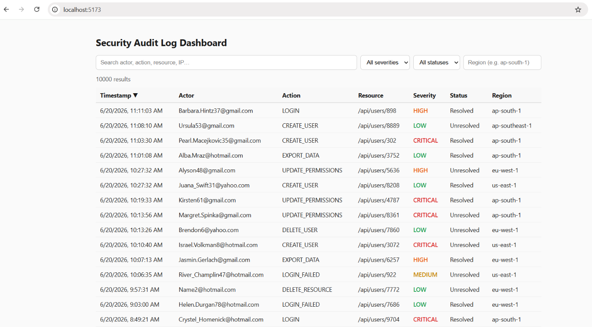
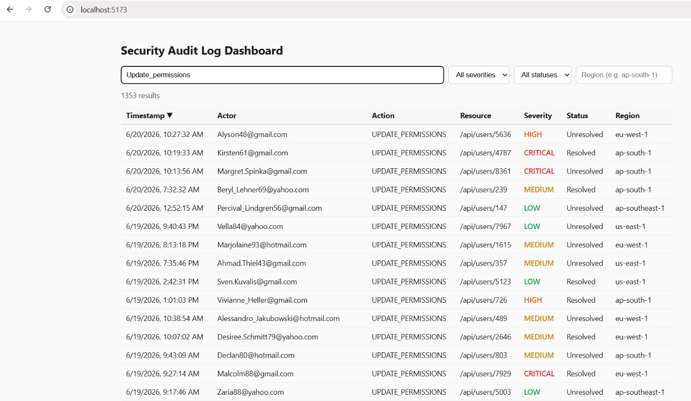
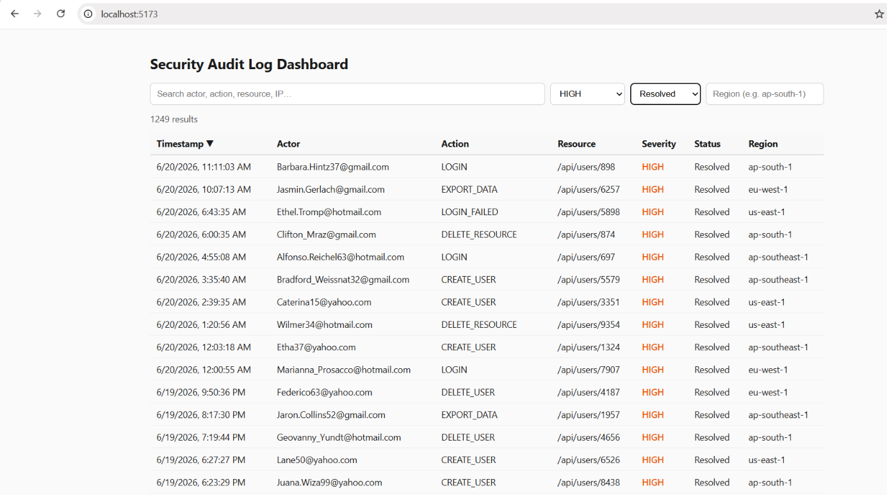
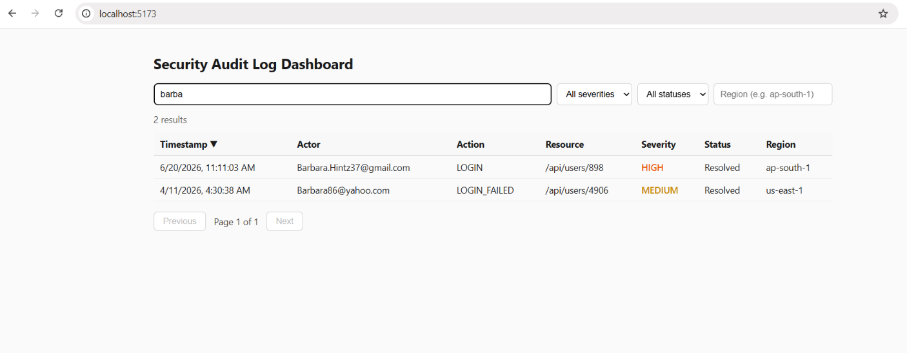
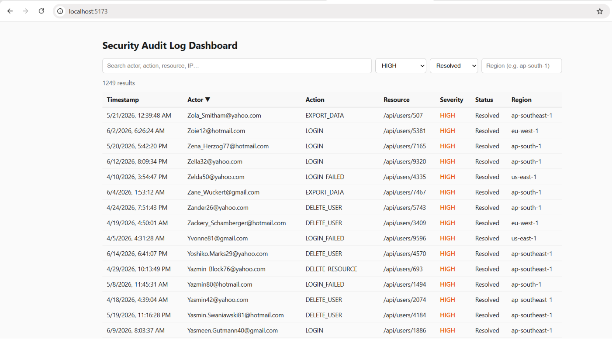
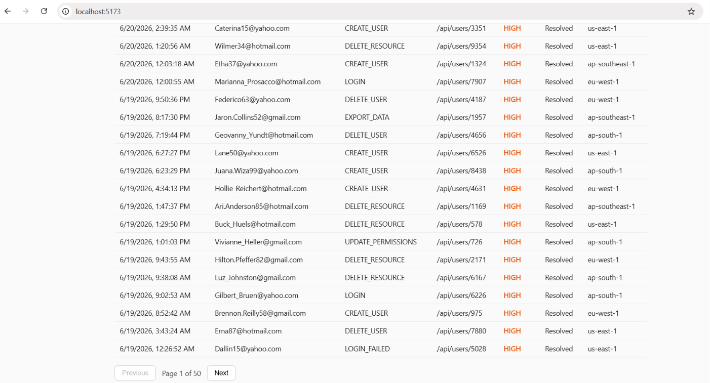

# Security Audit Log Dashboard

A full-stack dashboard for uploading, browsing, filtering, searching, sorting,
and paginating security audit logs. Built with React, Node.js/Express, and
MongoDB.

## Stack

- **Frontend:** React (Vite)
- **Backend:** Node.js, Express
- **Database:** MongoDB (Mongoose)

## Project Structure
project/

--->server/ Express API + MongoDB models

--->client/      React dashboard (Vite)
## Setup

### Prerequisites
- Node.js 18+
- A MongoDB instance (local, or a free MongoDB Atlas cluster)

### 1. Backend

```bash
cd server
npm install
cp .env.example .env   # edit MONGO_URI if not using local default
npm run dev             # starts on http://localhost:5000
```

### 2. Seed sample data (optional but recommended)

With the server running in another terminal:

```bash
cd server
npm run seed   # generates and bulk-uploads 10,000 mock log records
```

### 3. Frontend

```bash
cd client
npm install
npm run dev    # starts on http://localhost:5173, proxies /api to :5000
```

Open http://localhost:5173.

## API

### `POST /api/logs/bulk`
Accepts `{ "logs": [ {...}, {...} ] }`, up to 10,000 records per request.
Returns `{ requested, inserted, failed, errors }`.

### `GET /api/logs`
Query params (all optional): `severity, status, region, actor, action,
resourceType, from, to, search, sortBy, order, page, limit`.
Returns `{ logs, total, page, limit, totalPages }`.

### `GET /api/logs/:id`
Returns a single log record.

## Technical Decisions

- **Bulk upload in chunks of 1000 with `insertMany({ ordered: false })`:**
  inserting all 10,000 documents in one unordered batch lets MongoDB continue
  past invalid records instead of aborting the whole request on the first
  bad document, and chunking keeps each round-trip to MongoDB from getting
  too large. The response reports how many succeeded/failed and returns up
  to 50 sample errors for debugging.

- **All filtering, search, sorting, and pagination happen server-side**, as
  required by the spec. The client only sends query parameters; the server
  builds a Mongo filter object, applies `.sort().skip().limit()`, and runs a
  parallel `countDocuments()` for the total used to compute `totalPages`.
  This keeps the client lightweight regardless of how many logs exist.

- **Indexes:** `actor`, `action`, `resourceType`, `region`, `severity`,
  `status`, and `timestamp` are individually indexed since they're all
  common filter targets. A compound index on `{status, severity, timestamp}`
  speeds up the common "unresolved + severity, sorted by recency" query
  pattern.

- **Search** uses a case-insensitive regex `$or` query across
  `actor/action/resource/ipAddress` for true substring matching (e.g.
  searching "barba" correctly returns only matching actors). An earlier
  version used MongoDB's `$text` index, but `$text` performs OR-based
  keyword matching internally, which caused common substrings like "gmail"
  or "com" to match far too many unrelated records — regex matching gives
  more intuitive, precise results for a free-text search box.

- **Region filter** also uses a case-insensitive partial regex match
  (rather than an exact match), so typing `ap` correctly matches both
  `ap-south-1` and `ap-southeast-1`.

- **Offset-based pagination (`skip`/`limit`)** was used instead of
  cursor-based pagination for simplicity and because the UI needs page
  numbers / "page X of Y". Known trade-off: `skip()` gets slower at very
  high page numbers on huge collections; a cursor-based (keyset) approach
  would be the next optimization if log volume grew into the millions.

- **Field allow-list for `sortBy`** prevents arbitrary/unsafe sort
  expressions from being passed through from the query string.

- **Validation:** Mongoose schema validation (required fields, `enum` for
  `severity`/`status`) is the single source of truth on the server, so
  invalid records are rejected at the bulk-upload step rather than silently
  stored.

- **CORS + Vite proxy:** the dev client proxies `/api/*` to the Express
  server so there's no CORS friction locally; `cors()` is still enabled on
  the server for direct API use/deployment behind separate domains.

- **Seed script** (`npm run seed`) generates realistic mock logs via
  `@faker-js/faker` and posts them through the real bulk endpoint, so it
  doubles as an end-to-end test of the upload path.

## Deployment Notes

- Frontend: deploy `client/` to Vercel/Netlify (`npm run build` → `dist/`).
- Backend: deploy `server/` to Render/Railway; set `MONGO_URI` and `PORT`
  env vars.
- Database: MongoDB Atlas free tier works well for this scale.
- Update the frontend's API base URL (or Vite proxy target) to point at the
  deployed backend URL in production.

## Screenshots

### Dashboard Overview


### Filtering & Search




### Sorting


### Pagination
